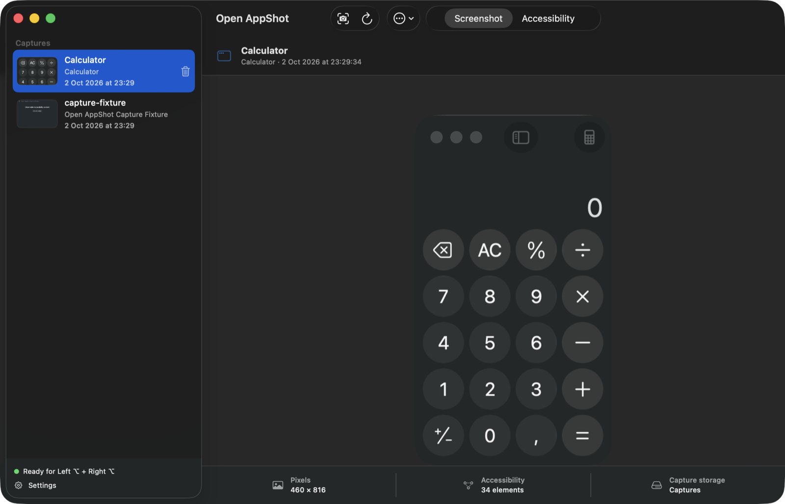

# Open AppShot

Open AppShot captures the last active macOS window as a screenshot plus its Accessibility tree, keeps a local history, and copies both to the clipboard. Paste the result into a chat or coding agent and it gets the pixels and the readable UI structure: buttons, labels, values, and their positions.

It only observes. It can't click, type, scroll, or trigger actions in the captured app, and it never uploads anything.



## Install

Open AppShot needs macOS 15 or later. Releases are universal, for Apple Silicon and Intel.

1. Download `OpenAppShot-X.Y.Z-macos-universal.zip` and the matching `.sha256` file from the [latest release](https://github.com/psg2/open-appshot/releases/latest).
2. Verify the archive in the download folder. The output must end in `OK`.

   ```sh
   shasum -a 256 -c OpenAppShot-X.Y.Z-macos-universal.zip.sha256
   ```

3. Unzip it and move **Open AppShot.app** to Applications.
4. Open the app. Releases are ad hoc signed, not notarized, so macOS blocks the first launch. Go to **System Settings > Privacy & Security** and choose **Open Anyway** next to the Open AppShot message. Apple explains this in [Open a Mac app from an unknown developer](https://support.apple.com/en-us/102445).

The checksum proves the archive matches the release. It isn't an Apple notarization check.

### Grant permissions

Open AppShot needs two permissions:

- **Accessibility**, for the global shortcut and to read the window's UI tree.
- **Screen Recording**, for the window pixels.

Choose **Request Permissions** in the app's banner or **Request Missing Permissions** in Settings. Then enable Open AppShot under **System Settings > Privacy & Security** and reopen the app if macOS asks.

macOS ties both grants to the exact ad hoc signed binary. After you install a new version, remove the old Open AppShot entries in **Privacy & Security** and grant them again.

## Use

Focus the window you want to share and press **Left Option + Right Option** together. The capture appears at the top of the history and lands on the clipboard. The default avoids Left Command + Right Command, which the Codex desktop app already uses. You can record another shortcut in Settings.

Open AppShot lives in the menu bar. Command-W closes the window, and the shortcut keeps working. The menu bar icon reopens the history, captures immediately, or opens Settings.

The main window lists captures on the left. On the right, **Screenshot** shows the window pixels and **Accessibility** shows the redacted UI summary. The bar underneath shows the image size, the number of Accessibility elements, and the storage folder.

| Shortcut | Action |
| --- | --- |
| Shift-Command-C | Capture the last active window |
| Option-Command-C | Copy the selected capture with the current clipboard mode |
| Option-Command-I | Copy only the screenshot |
| Option-Command-T | Copy only the Accessibility text |
| Shift-Command-R | Reveal the capture in Finder |
| Command-R | Reload the history |
| Delete | Delete the selected capture |

Settings (Command-comma) covers permissions, the capture shortcut, the confirmation sound, the clipboard mode, automatic copy, the capture folder, retention, delete confirmation, and **Open at login**. A launch at login starts in the menu bar without opening the window.

### Clipboard modes

| Mode | What it copies |
| --- | --- |
| Image + Full Accessibility (default) | The PNG, readable text for every element, and redacted JSON under `com.psg2.appshot-context-json` |
| Image + File References | The PNG and the local paths of `screenshot.png`, `accessibility.json`, and `context.md`. Useful for agents that read local files |
| Image Only | The PNG |
| Accessibility Only | The readable text and the JSON |

All representations go into one pasteboard item, and each app picks what it accepts. Slack pastes both the image and the text. Some chat apps, including the Codex and Claude desktop apps, take only the text. To get both there, paste the screenshot and the text separately with Option-Command-I and Option-Command-T.

## Storage and privacy

Captures live in `~/Library/Application Support/Open AppShot/Captures/`. If you choose another folder, Open AppShot creates an `Open AppShot/Captures` folder inside it and keeps showing captures from folders you used before.

Each capture is a folder with mode `0700`, and its files use `0600`:

- `screenshot.png` and `thumbnail.png`
- `accessibility.json`, the structured Accessibility tree
- `context.md`, the readable summary that goes on the clipboard
- `metadata.json` and a `.open-appshot-capture` ownership marker
- `windows.json`, which records the selected window

The Accessibility output redacts secure and password fields. If no Accessibility window clearly matches the captured window, the output says so and stays empty. Open AppShot never falls back to another window. A screenshot still contains anything visible in the window.

Retention deletes captures after 1, 7, 30, or 90 days, or never. It only deletes folders that carry the ownership marker or the exact layout of an older capture, and it leaves unrelated files and symbolic links alone. Captures are written to a hidden staging folder and move into the history only when complete.

Open AppShot doesn't use OCR, AI services, telemetry, or the network.

## Uninstall

From a source checkout, this removes the app and keeps captures, preferences, and permissions:

```sh
mise run uninstall
```

Removing data or permissions is explicit:

```sh
./Scripts/uninstall-local.sh --data                # verified Open AppShot captures only
./Scripts/uninstall-local.sh --preferences
./Scripts/uninstall-local.sh --reset-permissions   # Accessibility and Screen Recording grants
./Scripts/uninstall-local.sh --all
```

`--data` checks ownership with the current sources, so run `mise run build` first if you have no build.

## Build from source

You need macOS 15, Xcode 16 or later, and [mise](https://mise.jdx.dev/). mise installs the pinned tools and defines every task. `mise tasks` lists them.

```sh
mise install
mise run hooks     # pre-push hook that runs `mise run check`
mise run build
mise run install   # build and copy to /Applications
```

| Task | What it does |
| --- | --- |
| `format` | Rewrite Swift sources with swift-format |
| `lint` | swift-format, ShellCheck, actionlint, and plist checks |
| `test` | Unit tests, then the bundle and command-line contract tests |
| `scan-secrets` | Gitleaks on the working tree and the full history |
| `check` | All of the above. CI runs the same gates |
| `smoke` | Capture a fixture window and check every clipboard mode |
| `hotkey-smoke` | Install the app and trigger a real global-shortcut capture |

`test` needs no macOS permissions. `smoke` and `hotkey-smoke` need Accessibility and Screen Recording, so they only run locally. Run them when you change capture behavior.

## Architecture

`OpenAppShotCore` holds the capture pipeline, storage, and clipboard logic, and the `OpenAppShot` target holds the menu bar app. [docs/ARCHITECTURE.md](docs/ARCHITECTURE.md) describes the capture path and the storage rules. [CONTEXT.md](CONTEXT.md) defines the terms used in the code.

## Release

Pushing a `vX.Y.Z` tag that matches `VERSION` builds, tests, and publishes a universal ad hoc signed release with a checksum. See [docs/RELEASING.md](docs/RELEASING.md).

## License

[MIT](LICENSE)
